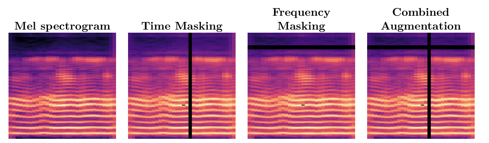

# parkinson-detection

## 📖 Description
This project is an implementation of my final year project **"Early Detection of Parkinson's Disease using Deep Learning Approaches"**.  
We used patients' audio recordings from the [Italian parkinson’s voice and speech dataset](https://ieee-dataport.org/open-access/italian-parkinsons-voice-and-speech) with different preprocessing techniques and several models.  

In this repository, I included one representative model for each data type:
- **VGG16 + CBAM** → for 2D spectrogram data  
- **SVM** → for tabular acoustic features  
- **ReSE-2-Multi** → for raw audio  

It was built mainly using **PyTorch**.  
The ultimate goal of this project is to create a **web application for Parkinson's disease detection**.  

---
## 🚀 Installation

Clone the repository and install the required dependencies:

```bash
git clone https://github.com/AbdelhamidKHELLADI/parkinson-detection
cd parkinson-detection
make install
```
## How to use
First, you need to create a `.env` file to store environment variables.
Alternatively, you can directly edit variable values in the code if working locally. 
### Segment records 
```bash
make segment
```
Segments the raw audio recordings into smaller clips.
### extract Features (Acoustic features & MFCC)
```bash
make preprocess
```
Extracts acoustic features and MFCCs from the segmented audio.
### create Mel spectrograms

```bash
make create_2d
```
Generates 2D Mel-spectrogram images from audio.



### create Mel spectrograms

```bash
make train _svm
```
Trains the SVM model on the extracted tabular features.


## 🛠 Project Structure

```bash
parkinson-detection/
├── etc/ # Config files or additional resources
├── models/ # Saved and trained models
├── predict/ # Prediction scripts 
├── preprocessing/ # Data preprocessing scripts
├── results/ # Experiment results, logs, and outputs
├── train/ # Training scripts for different models
└── utils/ # Utility/helper functions

```
